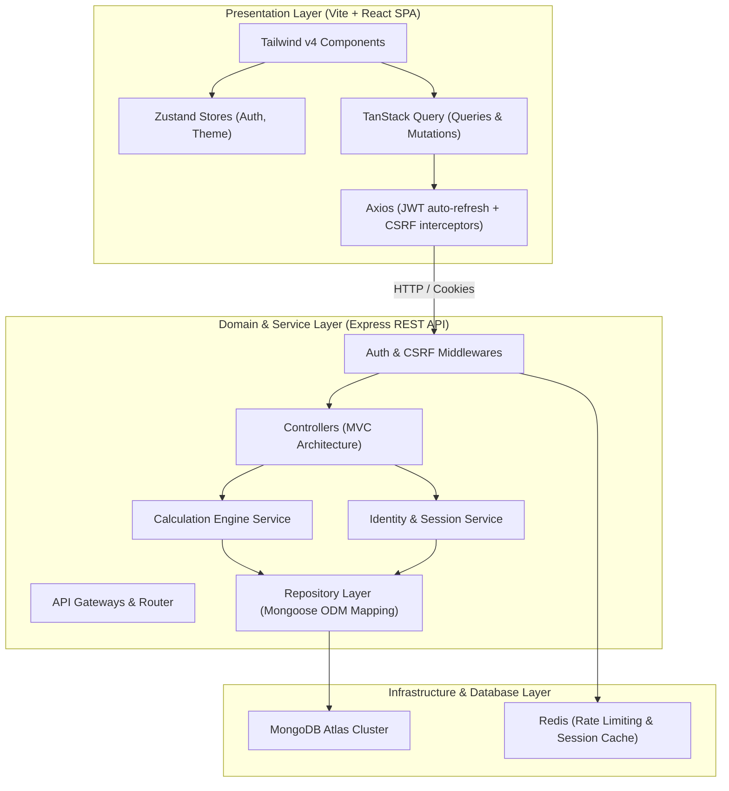
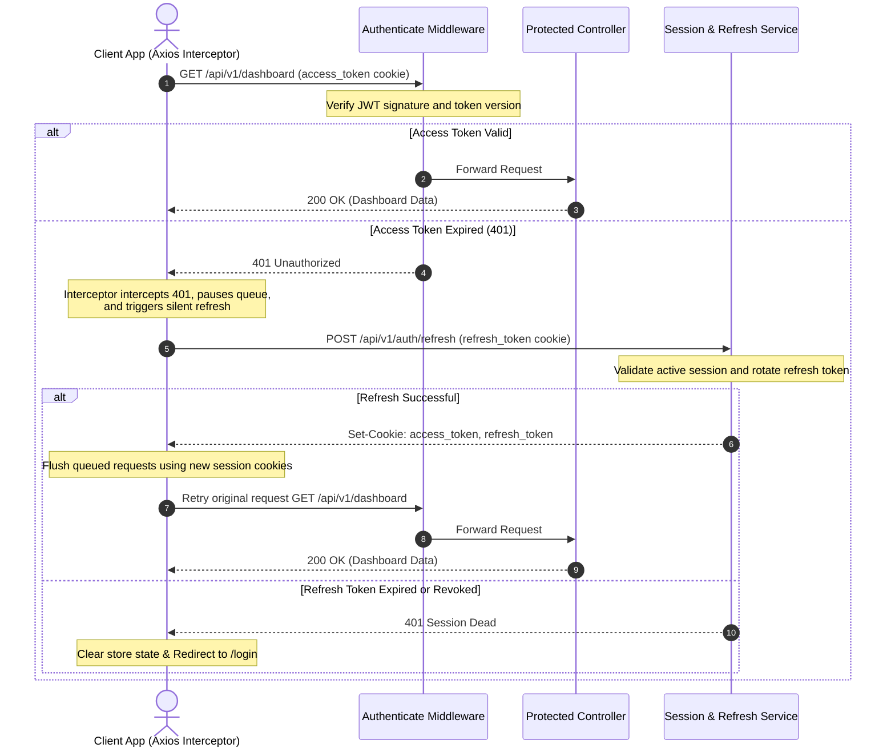
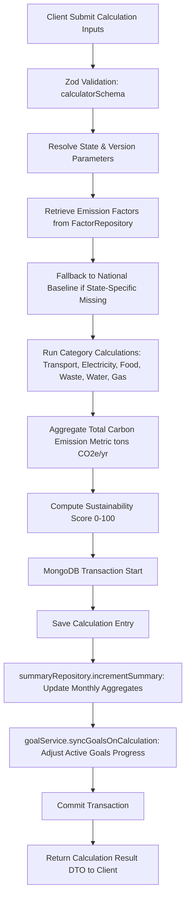

# 🌐 CarbonIQ — Enterprise Carbon Footprint Tracker & Analytics

CarbonIQ is a production-grade, full-stack carbon accounting and analytics platform designed for modular, explainable footprint calculations. Built with localized emission factor registries (such as Indian CEA, ARAI, and PPAC baselines), the system features an interactive analytics dashboard, target-driven goal tracking, multi-device session security, and downloadable PDF/CSV reports.

---

## 🏗️ System Architecture & Logical Layers



---

## 🔒 Security Architecture: Double-Submit CSRF Pattern

To safeguard state-mutating requests (`POST`, `PUT`, `PATCH`, `DELETE`) against Cross-Site Request Forgery (CSRF) vulnerabilities, CarbonIQ uses a double-submit cookie validation flow.

```mermaid
sequenceDiagram
    autonumber
    actor Client as Frontend React App
    participant CSRF as CSRF Middleware
    participant Controller as Express Router
    participant ClientCookie as Client Browser Cookie Jar

    Client->>CSRF: GET /api/v1/auth/csrf-token
    Note over CSRF: Generate secure random 32-byte token
    CSRF-->>ClientCookie: Set-Cookie: csrf_token=<token>; SameSite=Strict
    CSRF-->>Client: Response Body: { csrfToken: <token> }
    
    Note over Client: Axios caches token and automatically<br/>attaches it to "x-csrf-token" headers
    
    Client->>CSRF: POST /api/v1/calculator { payload }<br/>Header: x-csrf-token = <token>
    Note over CSRF: Compare request header x-csrf-token<br/>with csrf_token cookie via constant-time timingSafeEqual
    alt CSRF Match Successful
        CSRF->>Controller: Forward request to route handler
        Controller-->>Client: 201 Created (Calculation Logged)
    else Tokens Mismatch or Missing
        CSRF-->>Client: 403 Forbidden (Invalid CSRF Token)
    end
```

---

## 🔑 Session Lifespan & Token Rotation Lifecycle

CarbonIQ handles authentication via short-lived JWT Access Tokens stored in HttpOnly cookies, backed by long-lived Refresh Tokens stored in MongoDB Sessions for multi-device revocation.



---

## 📐 Calculation Engine & Summary Aggregation Pipeline



---

## 🚀 Quick Start (Local Development)

### Workspace Directory Layout
- `/frontend`: React SPA built with Vite, Tailwind CSS v4, Zustand, and TanStack Query.
- `/backend`: Node/Express REST API utilizing MongoDB Atlas, Pino logging, and secure HTTP-only cookies.
- `/docs`: Detailed system architecture blueprints.

### 1. Backend API Configuration
1. Navigate to `/backend`.
2. Configure `.env` based on `.env.example`:
   ```ini
   PORT=5000
   NODE_ENV=development
   MONGO_URI=mongodb+srv://...
   JWT_SECRET=supersecretjwtkeythatisextremelysecure
   ```
3. Install dependencies and start server:
   ```bash
   npm install
   npm run dev
   ```
4. Run integration tests:
   ```bash
   npm test
   ```

### 2. Frontend Configuration
1. Navigate to `/frontend`.
2. Install dependencies and launch Vite development server:
   ```bash
   npm install
   npm run dev
   ```
3. Visit `http://localhost:5173`. Navigate to `/design-system` to preview the interactive UI variables and components showcase.

---

## 📃 License

This project is licensed under the MIT License - see the [LICENSE](file:///c:/Users/Rishi%20Sharma/OneDrive/Desktop/PRODUCTION/carbonIQ/LICENSE) file for details.
